# 🗄️ Database Schema Reference

> **Reading order:** This is document **4 of 4**.
> Previous → [cli-reference.md](./cli-reference.md) | Start over → [index.md](./index.md)

> **Engine:** SQLite (via `better-sqlite3` + Drizzle ORM)
> **Location:** Configured in `.second-brain/config.yml` → `database_path`
> **Migrations:** `drizzle/` directory — applied automatically on first run

The SQLite database is a **derivative index** of the Markdown vault. It is never the source of truth — the `.md` files are. If the index drifts from disk, `doctor --repair` re-syncs it.

---

## Table of Contents

1. [Entity Relationship Diagram](#entity-relationship-diagram)
2. [Core Entity Tables](#core-entity-tables)
   - [inbox\_items](#-inbox_items)
   - [areas](#-areas)
   - [goals](#-goals)
   - [goal\_key\_results](#-goal_key_results)
   - [projects](#-projects)
   - [tasks](#-tasks)
   - [resources](#-resources)
   - [notes](#-notes)
3. [Supporting Tables](#supporting-tables)
   - [entity\_links](#-entity_links)
   - [entity\_taxonomy\_links](#-entity_taxonomy_links)
   - [taxonomy\_terms](#-taxonomy_terms)
   - [drive\_items](#-drive_items)
   - [archive\_events](#-archive_events)
   - [reviews](#-reviews)
   - [workspace\_kv](#-workspace_kv)
4. [Status Vocabularies](#status-vocabularies)
5. [Common Column Patterns](#common-column-patterns)
6. [Index Inventory](#index-inventory)

---

## Entity Relationship Diagram

```mermaid
erDiagram
    areas {
        text id PK
        text slug
        text title
        text file_path
        text status
        integer archived
        text area_type
        text created_at
        text updated_at
    }

    goals {
        text id PK
        text slug
        text title
        text file_path
        text status
        integer archived
        text target_date
        text quarter
        integer year
        text created_at
        text updated_at
    }

    goal_key_results {
        text id PK
        text goal_id FK
        text title
        integer completed
        text target_date
        integer sort_order
        text created_at
        text updated_at
    }

    projects {
        text id PK
        text slug
        text title
        text file_path
        text status
        integer archived
        integer priority
        text start_date
        text end_date
        text created_at
        text updated_at
    }

    tasks {
        text id PK
        text slug
        text title
        text file_path
        text status
        integer archived
        integer priority
        text energy
        text do_date
        text start_time
        text end_time
        text created_at
        text updated_at
    }

    resources {
        text id PK
        text slug
        text title
        text file_path
        text status
        integer archived
        text resource_type
        text source_url
        integer pinned
        text created_at
        text updated_at
    }

    notes {
        text id PK
        text slug
        text title
        text file_path
        text status
        integer archived
        text topic_summary
        integer pinned
        integer favorite
        text notebook
        text created_at
        text updated_at
    }

    inbox_items {
        text id PK
        text slug
        text title
        text file_path
        text status
        integer archived
        text raw_input
        text suggested_entity_type
        text processed_at
        text created_at
        text updated_at
    }

    entity_links {
        text id PK
        text from_entity_type
        text from_entity_id
        text to_entity_type
        text to_entity_id
        text link_kind
        text created_at
    }

    taxonomy_terms {
        text id PK
        text name
        text kind
        text created_at
        text updated_at
    }

    entity_taxonomy_links {
        text id PK
        text entity_type
        text entity_id
        text taxonomy_term_id FK
        text created_at
    }

    drive_items {
        text id PK
        text slug
        text title
        text file_path
        text item_type
        text description
        text original_name
        text source_path
        text imported_at
        text mime_type
        text sha256
        integer child_count
        integer archived
        text archived_at
        text archive_reason
        text area_ids_json
        text project_ids_json
        text task_ids_json
        text note_ids_json
        text goal_ids_json
        text tags_json
        text created_at
        text updated_at
    }

    archive_events {
        text id PK
        text entity_type
        text entity_id
        text occurred_at
        text reason
        text previous_path
        text new_path
        text created_at
    }

    reviews {
        text id PK
        text review_kind
        text started_at
        text completed_at
        text artifact_path
        text summary
        text created_at
    }

    goals ||--o{ goal_key_results : "has key results"
    taxonomy_terms ||--o{ entity_taxonomy_links : "tagged via"
    areas ||--o{ entity_links : "linked from/to"
    goals ||--o{ entity_links : "linked from/to"
    projects ||--o{ entity_links : "linked from/to"
    tasks ||--o{ entity_links : "linked from/to"
    resources ||--o{ entity_links : "linked from/to"
    notes ||--o{ entity_links : "linked from/to"
```



---

## Core Entity Tables

All core entity tables share the same foundational shape:

```
┌─────────────────────────────────────────────────────┐
│              SHARED COLUMN PATTERN                  │
├─────────────┬───────────────────────────────────────┤
│ id          │ TEXT PRIMARY KEY — stable UUID         │
│ slug        │ TEXT — kebab-case URL-safe identifier  │
│ title       │ TEXT — human readable name             │
│ file_path   │ TEXT — workspace-relative path to .md  │
│ status      │ TEXT — kind-specific workflow status   │
│ archived    │ INTEGER (boolean) — 0=active, 1=archived│
│ created_at  │ TEXT — ISO-8601 timestamp              │
│ updated_at  │ TEXT — ISO-8601 timestamp              │
└─────────────┴───────────────────────────────────────┘
```

---

### 📥 `inbox_items`

**Purpose:** Raw captures that have not yet been classified into a typed entity. Everything captured with `second-brain-os capture "text"` lands here first.

```
┌────────────────────────────────────────────────────────────────┐
│  inbox_items                                                   │
├──────────────────────┬─────────┬─────────────────────────────┤
│ Column               │ Type    │ Description                  │
├──────────────────────┼─────────┼─────────────────────────────┤
│ id                   │ TEXT PK │ Stable UUID                  │
│ slug                 │ TEXT    │ kebab-case identifier         │
│ title                │ TEXT    │ Captured title/text           │
│ file_path            │ TEXT    │ Path under 00-inbox/          │
│ status               │ TEXT    │ See status vocab below        │
│ archived             │ INTEGER │ Boolean flag                  │
│ raw_input            │ TEXT    │ Original raw text from user   │
│ suggested_entity_type│ TEXT    │ AI/heuristic suggestion       │
│ processed_at         │ TEXT    │ When promoted/organized       │
│ created_at           │ TEXT    │ ISO-8601                      │
│ updated_at           │ TEXT    │ ISO-8601                      │
└──────────────────────┴─────────┴─────────────────────────────┘
```

**Indexes:** `inbox_items_slug_idx (slug)`, `inbox_items_file_path_idx (file_path)`

**Lifecycle:** `inbox` → promoted via `organize promote` → becomes Area, Goal, Project, Task, Resource, or Note.

---

### 🏠 `areas`

**Purpose:** Long-running spheres of life or work (e.g. "Health", "Career", "Side Projects"). Areas are containers that group Goals and Projects beneath them.

```
┌──────────────────────────────────────────────────────┐
│  areas                                               │
├───────────┬─────────┬──────────────────────────────┤
│ Column    │ Type    │ Description                   │
├───────────┼─────────┼──────────────────────────────┤
│ id        │ TEXT PK │ Stable UUID                   │
│ slug      │ TEXT    │ kebab-case identifier          │
│ title     │ TEXT    │ Area name                      │
│ file_path │ TEXT    │ Path under 01-areas/           │
│ status    │ TEXT    │ active | archived              │
│ archived  │ INTEGER │ Boolean flag                   │
│ area_type │ TEXT    │ Optional classification label  │
│ created_at│ TEXT    │ ISO-8601                       │
│ updated_at│ TEXT    │ ISO-8601                       │
└───────────┴─────────┴──────────────────────────────┘
```

**Indexes:** `areas_slug_idx`, `areas_file_path_idx`

**Relations:** Areas are referenced by Goals, Projects, Tasks, Resources, Notes, and Drive Items via `entity_links` and JSON ID arrays.

---

### 🎯 `goals`

**Purpose:** Time-boxed outcomes tied to one or more Areas. Goals track the "what you want to achieve" layer and can have measurable Key Results (OKR-style).

```
┌────────────────────────────────────────────────────────┐
│  goals                                                 │
├─────────────┬─────────┬────────────────────────────── ┤
│ Column      │ Type    │ Description                    │
├─────────────┼─────────┼────────────────────────────── ┤
│ id          │ TEXT PK │ Stable UUID                    │
│ slug        │ TEXT    │ kebab-case identifier           │
│ title       │ TEXT    │ Goal title                     │
│ file_path   │ TEXT    │ Path under 02-goals/           │
│ status      │ TEXT    │ draft|active|completed|abandoned│
│ archived    │ INTEGER │ Boolean flag                   │
│ target_date │ TEXT    │ ISO date (optional)            │
│ quarter     │ TEXT    │ e.g. "Q1", "Q2" (optional)    │
│ year        │ INTEGER │ Calendar year (optional)       │
│ created_at  │ TEXT    │ ISO-8601                       │
│ updated_at  │ TEXT    │ ISO-8601                       │
└─────────────┴─────────┴────────────────────────────── ┘
```

**Indexes:** `goals_slug_idx`, `goals_file_path_idx`

**Child table:** `goal_key_results` (cascade delete on goal removal)

---

### 🔑 `goal_key_results`

**Purpose:** Measurable sub-milestones for a Goal (OKR "Key Results"). Each goal can have multiple ordered key results.

```
┌────────────────────────────────────────────────────────┐
│  goal_key_results                                      │
├────────────┬─────────┬─────────────────────────────── ┤
│ Column     │ Type    │ Description                     │
├────────────┼─────────┼─────────────────────────────── ┤
│ id         │ TEXT PK │ Stable UUID                     │
│ goal_id    │ TEXT FK │ → goals.id (CASCADE DELETE)     │
│ title      │ TEXT    │ Key result description           │
│ completed  │ INTEGER │ Boolean — done or not           │
│ target_date│ TEXT    │ Optional per-KR deadline        │
│ sort_order │ INTEGER │ Display ordering (default 0)    │
│ created_at │ TEXT    │ ISO-8601                        │
│ updated_at │ TEXT    │ ISO-8601                        │
└────────────┴─────────┴─────────────────────────────── ┘
```

**Indexes:** `goal_key_results_goal_id_idx`

**Constraint:** `FOREIGN KEY (goal_id) REFERENCES goals(id) ON DELETE CASCADE ON UPDATE CASCADE`

---

### 📁 `projects`

**Purpose:** Bounded, completable bodies of work tied to Areas and/or Goals. Unlike Areas (ongoing), Projects have a defined end state.

```
┌──────────────────────────────────────────────────────────────┐
│  projects                                                    │
├────────────┬─────────┬────────────────────────────────────── ┤
│ Column     │ Type    │ Description                            │
├────────────┼─────────┼────────────────────────────────────── ┤
│ id         │ TEXT PK │ Stable UUID                            │
│ slug       │ TEXT    │ kebab-case identifier                   │
│ title      │ TEXT    │ Project name                           │
│ file_path  │ TEXT    │ Path under 03-projects/                │
│ status     │ TEXT    │ inbox|active|on_hold|done|cancelled    │
│ archived   │ INTEGER │ Boolean flag                           │
│ priority   │ INTEGER │ Numeric priority level (optional)      │
│ start_date │ TEXT    │ ISO date (optional)                    │
│ end_date   │ TEXT    │ ISO date (optional)                    │
│ created_at │ TEXT    │ ISO-8601                               │
│ updated_at │ TEXT    │ ISO-8601                               │
└────────────┴─────────┴────────────────────────────────────── ┘
```

**Indexes:** `projects_slug_idx`, `projects_file_path_idx`

---

### ✅ `tasks`

**Purpose:** Individual actionable work items. The most granular unit of work. Tasks support scheduling (`do_date`, `start_time`, `end_time`), energy labeling, and priority.

```
┌──────────────────────────────────────────────────────────────────────┐
│  tasks                                                               │
├────────────┬─────────┬────────────────────────────────────────────── ┤
│ Column     │ Type    │ Description                                    │
├────────────┼─────────┼────────────────────────────────────────────── ┤
│ id         │ TEXT PK │ Stable UUID                                    │
│ slug       │ TEXT    │ kebab-case identifier                           │
│ title      │ TEXT    │ Task title                                     │
│ file_path  │ TEXT    │ Path under 04-tasks/                           │
│ status     │ TEXT    │ inbox|next|waiting|scheduled|done|cancelled    │
│ archived   │ INTEGER │ Boolean flag                                   │
│ priority   │ INTEGER │ Numeric priority (optional)                    │
│ energy     │ TEXT    │ Energy label: low|medium|high (optional)       │
│ do_date    │ TEXT    │ ISO date — when to do it (drives today/dash)   │
│ start_time │ TEXT    │ HH:MM time block start (optional)              │
│ end_time   │ TEXT    │ HH:MM time block end (optional)                │
│ created_at │ TEXT    │ ISO-8601                                       │
│ updated_at │ TEXT    │ ISO-8601                                       │
└────────────┴─────────┴────────────────────────────────────────────── ┘
```

**Indexes:** `tasks_slug_idx`, `tasks_file_path_idx`

> **Note on `do_date`:** Tasks with a `do_date` appear in `today` / `dashboard show` under Overdue, Due Today, or Upcoming buckets. Tasks without a `do_date` and not in a focus-status appear only in the Backlog count.

---

### 📚 `resources`

**Purpose:** Reference material, articles, books, links, tools — things you consume or reference. Resources can be pinned and tagged with a type and source URL.

```
┌──────────────────────────────────────────────────────────┐
│  resources                                               │
├───────────────┬─────────┬──────────────────────────────┤
│ Column        │ Type    │ Description                   │
├───────────────┼─────────┼──────────────────────────────┤
│ id            │ TEXT PK │ Stable UUID                   │
│ slug          │ TEXT    │ kebab-case identifier          │
│ title         │ TEXT    │ Resource title                 │
│ file_path     │ TEXT    │ Path under 05-resources/      │
│ status        │ TEXT    │ inbox | active | archived      │
│ archived      │ INTEGER │ Boolean flag                   │
│ resource_type │ TEXT    │ Optional classification label  │
│ source_url    │ TEXT    │ Original URL/reference (opt)  │
│ pinned        │ INTEGER │ Boolean — pin to top           │
│ created_at    │ TEXT    │ ISO-8601                       │
│ updated_at    │ TEXT    │ ISO-8601                       │
└───────────────┴─────────┴──────────────────────────────┘
```

**Indexes:** `resources_slug_idx`, `resources_file_path_idx`

---

### 📝 `notes`

**Purpose:** Free-form knowledge, ideas, meeting notes, and evergreen writing. Notes can be organized into named notebooks and pinned/favorited.

```
┌──────────────────────────────────────────────────────────┐
│  notes                                                   │
├───────────────┬─────────┬──────────────────────────────┤
│ Column        │ Type    │ Description                   │
├───────────────┼─────────┼──────────────────────────────┤
│ id            │ TEXT PK │ Stable UUID                   │
│ slug          │ TEXT    │ kebab-case identifier          │
│ title         │ TEXT    │ Note title                     │
│ file_path     │ TEXT    │ Path under 06-notes/           │
│ status        │ TEXT    │ inbox | active | archived      │
│ archived      │ INTEGER │ Boolean flag                   │
│ topic_summary │ TEXT    │ Short generated/manual summary │
│ pinned        │ INTEGER │ Boolean — pin to top           │
│ favorite      │ INTEGER │ Boolean — mark as favorite     │
│ notebook      │ TEXT    │ Logical grouping label         │
│ created_at    │ TEXT    │ ISO-8601                       │
│ updated_at    │ TEXT    │ ISO-8601                       │
└───────────────┴─────────┴──────────────────────────────┘
```

**Indexes:** `notes_slug_idx`, `notes_file_path_idx`

---

## Supporting Tables

---

### 🔗 `entity_links`

**Purpose:** Polymorphic directed edge table. Stores typed relationships between any two entities — e.g. a Task belonging to a Project, or a Goal linked to an Area. This is the central **graph layer** of the vault.

```
┌──────────────────────────────────────────────────────────────┐
│  entity_links                                                │
├──────────────────┬─────────┬──────────────────────────────── ┤
│ Column           │ Type    │ Description                      │
├──────────────────┼─────────┼──────────────────────────────── ┤
│ id               │ TEXT PK │ Stable UUID                      │
│ from_entity_type │ TEXT    │ Kind of source entity            │
│ from_entity_id   │ TEXT    │ Source entity UUID               │
│ to_entity_type   │ TEXT    │ Kind of target entity            │
│ to_entity_id     │ TEXT    │ Target entity UUID               │
│ link_kind        │ TEXT    │ Relationship type label          │
│ created_at       │ TEXT    │ ISO-8601                         │
└──────────────────┴─────────┴──────────────────────────────── ┘
```

**Indexes:**
- `entity_links_from_idx (from_entity_type, from_entity_id)`
- `entity_links_to_idx (to_entity_type, to_entity_id)`

**Usage pattern:**

```
  [task: "Write report"]  ──belongs_to──▶  [project: "Q1 Report"]
  [project: "Q1 Report"]  ──belongs_to──▶  [area: "Work"]
  [goal: "Get fit"]       ──belongs_to──▶  [area: "Health"]
```

---

### 🏷️ `taxonomy_terms`

**Purpose:** Canonical registry of tags and other classification labels (e.g. `tag:typescript`, `context:office`). Normalized to avoid duplication.

```
┌───────────────────────────────────────────────────┐
│  taxonomy_terms                                   │
├────────────┬─────────┬────────────────────────── ┤
│ Column     │ Type    │ Description                │
├────────────┼─────────┼────────────────────────── ┤
│ id         │ TEXT PK │ Stable UUID               │
│ name       │ TEXT    │ Term value (e.g. "async") │
│ kind       │ TEXT    │ Term category (e.g. "tag")│
│ created_at │ TEXT    │ ISO-8601                  │
│ updated_at │ TEXT    │ ISO-8601                  │
└────────────┴─────────┴────────────────────────── ┘
```

**Indexes:** `taxonomy_terms_name_kind_idx (name, kind)`

---

### 🔖 `entity_taxonomy_links`

**Purpose:** Junction table connecting any entity to taxonomy terms (tags/labels). One entity can have many taxonomy terms; one term can apply to many entities.

```
┌──────────────────────────────────────────────────────────────┐
│  entity_taxonomy_links                                       │
├──────────────────┬─────────┬──────────────────────────────── ┤
│ Column           │ Type    │ Description                      │
├──────────────────┼─────────┼──────────────────────────────── ┤
│ id               │ TEXT PK │ Stable UUID                      │
│ entity_type      │ TEXT    │ Kind of the tagged entity        │
│ entity_id        │ TEXT    │ UUID of the tagged entity        │
│ taxonomy_term_id │ TEXT FK │ → taxonomy_terms.id (CASCADE)   │
│ created_at       │ TEXT    │ ISO-8601                         │
└──────────────────┴─────────┴──────────────────────────────── ┘
```

**Indexes:**
- `entity_taxonomy_entity_idx (entity_type, entity_id)`
- `entity_taxonomy_term_idx (taxonomy_term_id)`

---

### 💾 `drive_items`

**Purpose:** Index of imported external files and folders stored under `07-drive/items/`. Drive items are standalone vault objects — not typed PARA entities — but can be linked to any entity.

```
┌──────────────────────────────────────────────────────────────────────┐
│  drive_items                                                         │
├─────────────────┬─────────┬───────────────────────────────────────── ┤
│ Column          │ Type    │ Description                               │
├─────────────────┼─────────┼───────────────────────────────────────── ┤
│ id              │ TEXT PK │ Stable UUID                               │
│ slug            │ TEXT    │ kebab-case identifier                      │
│ title           │ TEXT    │ Display title                             │
│ file_path       │ TEXT    │ Path to item.md inside the package        │
│ item_type       │ TEXT    │ "file" | "folder"                         │
│ description     │ TEXT    │ Description stored in front matter        │
│ original_name   │ TEXT    │ Source filename/dirname                   │
│ source_path     │ TEXT    │ Original import path (optional)           │
│ imported_at     │ TEXT    │ ISO-8601 import timestamp                 │
│ mime_type       │ TEXT    │ MIME type (optional, for files)           │
│ sha256          │ TEXT    │ File hash (optional)                      │
│ child_count     │ INTEGER │ # files if item is a folder               │
│ archived        │ INTEGER │ Boolean — is archived                     │
│ archived_at     │ TEXT    │ When archived (optional)                  │
│ archive_reason  │ TEXT    │ Why archived (optional)                   │
│ area_ids_json   │ TEXT    │ JSON array of linked area UUIDs           │
│ project_ids_json│ TEXT    │ JSON array of linked project UUIDs       │
│ task_ids_json   │ TEXT    │ JSON array of linked task UUIDs           │
│ note_ids_json   │ TEXT    │ JSON array of linked note UUIDs           │
│ goal_ids_json   │ TEXT    │ JSON array of linked goal UUIDs           │
│ tags_json       │ TEXT    │ JSON array of tag strings                 │
│ created_at      │ TEXT    │ ISO-8601                                  │
│ updated_at      │ TEXT    │ ISO-8601                                  │
└─────────────────┴─────────┴───────────────────────────────────────── ┘
```

**Indexes:** `drive_items_slug_idx`, `drive_items_file_path_idx`

> **Design note:** Relationship IDs are stored as JSON text arrays (`*_ids_json`) rather than normalized join rows, mirroring the `item.md` front matter directly for fast rebuild.

---

### 📦 `archive_events`

**Purpose:** Audit log of every archive and restore operation. Records where a file was and where it moved, enabling the `doctor` command to detect and repair path drift.

```
┌────────────────────────────────────────────────────────┐
│  archive_events                                        │
├───────────────┬─────────┬────────────────────────────┤
│ Column        │ Type    │ Description                 │
├───────────────┼─────────┼────────────────────────────┤
│ id            │ TEXT PK │ Stable UUID                 │
│ entity_type   │ TEXT    │ Kind of archived entity     │
│ entity_id     │ TEXT    │ UUID of archived entity     │
│ occurred_at   │ TEXT    │ ISO-8601 event time         │
│ reason        │ TEXT    │ User-supplied reason (opt)  │
│ previous_path │ TEXT    │ Path before archiving       │
│ new_path      │ TEXT    │ Path after archiving        │
│ created_at    │ TEXT    │ ISO-8601 row insert time    │
└───────────────┴─────────┴────────────────────────────┘
```

**Indexes:** `archive_events_entity_idx (entity_type, entity_id)`

---

### 📋 `reviews`

**Purpose:** Log of completed review sessions (weekly, etc.). Stores timing, the markdown artifact path, and an optional summary.

```
┌─────────────────────────────────────────────────────────┐
│  reviews                                                │
├───────────────┬─────────┬─────────────────────────────┤
│ Column        │ Type    │ Description                  │
├───────────────┼─────────┼─────────────────────────────┤
│ id            │ TEXT PK │ Stable UUID                  │
│ review_kind   │ TEXT    │ "weekly" | "daily" | etc.    │
│ started_at    │ TEXT    │ ISO-8601 start               │
│ completed_at  │ TEXT    │ ISO-8601 completion (opt)    │
│ artifact_path │ TEXT    │ Path to generated .md report │
│ summary       │ TEXT    │ Short text summary (opt)     │
│ created_at    │ TEXT    │ ISO-8601 row insert time     │
└───────────────┴─────────┴─────────────────────────────┘
```

**Indexes:** `reviews_kind_idx (review_kind)`

---

### ⚙️ `workspace_kv`

**Purpose:** Simple key-value store for workspace-scoped runtime state (e.g. migration versions, internal flags). Not user-facing.

```
┌──────────────────────────────────────────────────┐
│  workspace_kv                                    │
├──────────┬─────────┬─────────────────────────── ┤
│ Column   │ Type    │ Description                 │
├──────────┼─────────┼─────────────────────────── ┤
│ key      │ TEXT PK │ Setting key                 │
│ value    │ TEXT    │ Serialized value            │
└──────────┴─────────┴─────────────────────────── ┘
```

---

## Status Vocabularies

Each entity kind has its own valid status set:

```
┌────────────────┬──────────────────────────────────────────────────────┐
│ Entity Kind    │ Valid Statuses                                        │
├────────────────┼──────────────────────────────────────────────────────┤
│ inbox_item     │ inbox                                                 │
│ area           │ active │ archived                                     │
│ goal           │ draft │ active │ completed │ abandoned                │
│ project        │ inbox │ active │ on_hold │ done │ cancelled           │
│ task           │ inbox │ next │ waiting │ scheduled │ done │ cancelled │
│ resource       │ inbox │ active │ archived                             │
│ note           │ inbox │ active │ archived                             │
└────────────────┴──────────────────────────────────────────────────────┘
```

**Task status flow:**

```
  inbox ──▶ next ──▶ [doing] ──▶ done
              │                    │
              ▼                    ▼
           waiting           cancelled
              │
              ▼
          scheduled
```

---

## Common Column Patterns

### IDs and Identity

```
id   = UUID v4 string — stable primary key, also stored in frontmatter
slug = kebab-case — human readable, URL/filesystem-safe
      pattern: ^[a-z0-9]+(-[a-z0-9]+)*$  max 120 chars
```

### Timestamps

All timestamps are stored as ISO-8601 strings (not Unix epoch), chosen for human readability and inspectability in the SQLite file:

```
created_at  = "2026-01-15T09:42:00.000Z"
updated_at  = "2026-01-15T09:42:00.000Z"
```

### Booleans

SQLite has no native boolean type. The schema uses `INTEGER` with Drizzle's `{ mode: 'boolean' }` adapter:

```
archived = 0   (false / active)
archived = 1   (true / archived)
```

### file_path

All `file_path` columns store **workspace-relative** paths to the canonical `index.md` file inside the entity's package directory:

```
01-areas/my-health/index.md
04-tasks/write-report/index.md
07-drive/items/my-document/item.md
```

---

## Index Inventory

```
┌─────────────────────────────────────────────────────────┬─────────────────────────────────────┐
│ Index Name                                              │ Columns                             │
├─────────────────────────────────────────────────────────┼─────────────────────────────────────┤
│ areas_slug_idx                                          │ slug                                │
│ areas_file_path_idx                                     │ file_path                           │
│ goals_slug_idx                                          │ slug                                │
│ goals_file_path_idx                                     │ file_path                           │
│ goal_key_results_goal_id_idx                            │ goal_id                             │
│ projects_slug_idx                                       │ slug                                │
│ projects_file_path_idx                                  │ file_path                           │
│ tasks_slug_idx                                          │ slug                                │
│ tasks_file_path_idx                                     │ file_path                           │
│ resources_slug_idx                                      │ slug                                │
│ resources_file_path_idx                                 │ file_path                           │
│ notes_slug_idx                                          │ slug                                │
│ notes_file_path_idx                                     │ file_path                           │
│ inbox_items_slug_idx                                    │ slug                                │
│ inbox_items_file_path_idx                               │ file_path                           │
│ taxonomy_terms_name_kind_idx                            │ (name, kind)                        │
│ entity_taxonomy_entity_idx                              │ (entity_type, entity_id)            │
│ entity_taxonomy_term_idx                                │ taxonomy_term_id                    │
│ entity_links_from_idx                                   │ (from_entity_type, from_entity_id)  │
│ entity_links_to_idx                                     │ (to_entity_type, to_entity_id)      │
│ drive_items_slug_idx                                    │ slug                                │
│ drive_items_file_path_idx                               │ file_path                           │
│ archive_events_entity_idx                               │ (entity_type, entity_id)            │
│ reviews_kind_idx                                        │ review_kind                         │
└─────────────────────────────────────────────────────────┴─────────────────────────────────────┘
```
